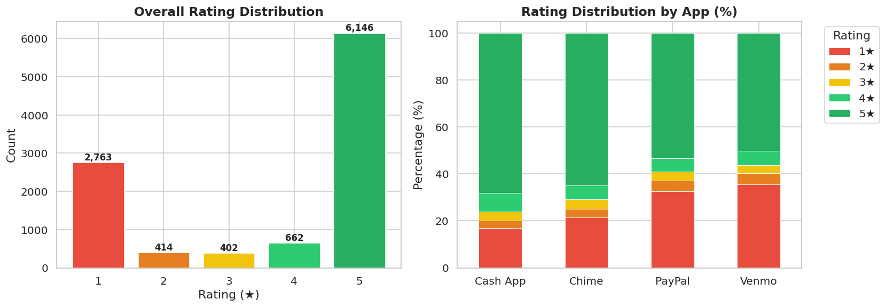
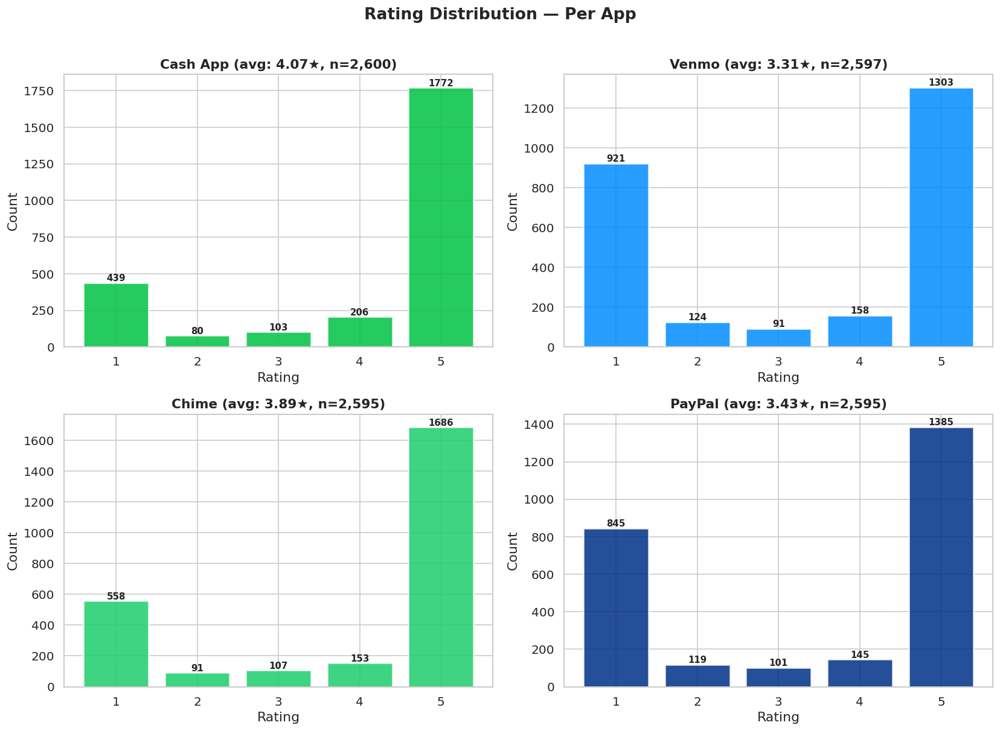
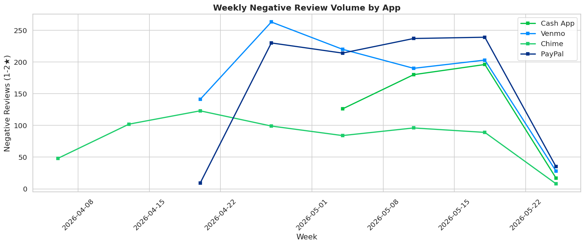
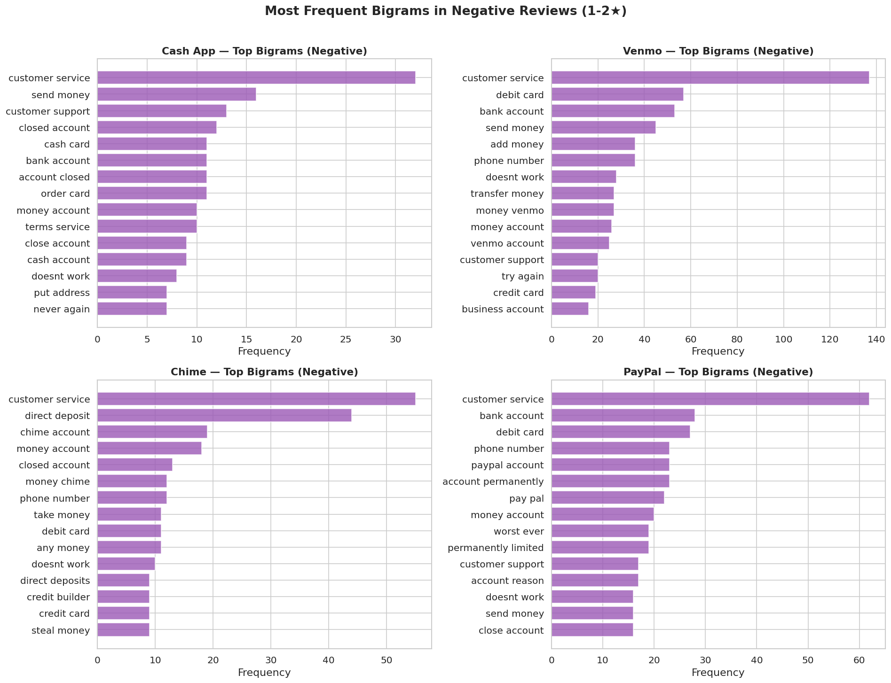

<div align="center">

# Fintech Sentiment Intelligence

### Competitive Analytics Case Study — Why Venmo Is Bleeding Users and How to Fix It

[](https://python.org)
[](https://jupyter.org)
[](https://pandas.pydata.org)
[](https://www.nltk.org)
[](https://scikit-learn.org)
[](https://matplotlib.org)
[](LICENSE)

**[🔗 View Live Case Study](https://sentiment.johnkirima.com/)** · **[📊 Explore the Data](#visual-results)** · **[📁 Repository Structure](#repository-structure)**

</div>

---

## Table of Contents

- [Project Overview](#-project-overview)
- [Key Findings](#-key-findings)
- [Visual Results](#-visual-results)
- [Methodology](#-methodology)
- [Tech Stack](#-tech-stack)
- [Repository Structure](#-repository-structure)
- [How to Run](#-how-to-run)
- [Results & Deliverables](#-results--deliverables)
- [Business Impact](#-business-impact)
- [Author](#-author)
- [License](#-license)

---

## 📋 Project Overview

### The Business Problem

In fintech, **every 0.1-star drop in app store rating costs roughly $500K–$1M in lost installs per year**. When Venmo's negative review rate hit **40.2%** — double that of competitor Cash App — something was clearly broken. But the product team didn't know *what*, *where*, or *how much* it was costing.

Traditional analytics dashboards track *ratings*. They don't explain *why* users are angry. And standard NLP tools like VADER miss **26% of critical complaints** — the sarcastic, technical, and financial-jargon-heavy reviews that carry the most operational signal.

### What This Project Does

This project reverse-engineers the competitive gap between four major fintech apps by analyzing **10,386 real Google Play Store reviews** using a multi-phase NLP pipeline:

1. **Scrapes and cleans** real user reviews from Cash App, Venmo, Chime, and PayPal
2. **Scores sentiment** using VADER, then validates against star ratings to expose where rule-based NLP fails
3. **Clusters complaints** into actionable topic groups using LDA topic modeling
4. **Quantifies the revenue impact** of each failure mode to prioritize product fixes

The result: a prioritized list of product recommendations with an estimated **$2–4M annual revenue recovery opportunity**.

---

## 🎯 Key Findings

| Finding | Impact |
|---|---|
| **Venmo's negative review rate is 2× Cash App's** | 40.2% vs. 20.0% — Venmo has a structural UX/trust problem, not just bad luck |
| **26% of critical complaints are invisible to VADER** | Rule-based sentiment analysis misclassifies sarcasm, financial jargon, and multi-issue reviews |
| **VADER achieves only 59% recall on negative reviews** | 4 out of 10 angry users are being ignored in any VADER-based monitoring pipeline |
| **Negative reviews are 2.5× longer than positive ones** | Angry users write detailed complaints — these are the highest-signal reviews and they're being missed |
| **$2–4M in annual revenue is recoverable** | Fixing the top 3 complaint clusters could recover 0.3 stars and prevent thousands of churned installs |

---

## 📊 Visual Results

### Rating Distribution Across Apps
> Venmo and PayPal show significantly heavier tails in the 1–2 star range compared to Cash App and Chime.



### Per-App Rating Breakdown
> Cash App maintains a healthier distribution with 60%+ positive reviews, while Venmo's distribution is nearly inverted.



### Negative Review Trends Over Time
> Weekly negative review volume reveals spikes that correlate with app updates and service incidents.



### Top Complaint Themes by App (Negative Bigrams)
> "Customer service," "bank account," and "direct deposit" dominate — these are operational failures, not cosmetic complaints.



---

## 🔬 Methodology

### Phase 1 — Data Acquisition & EDA
- Scraped **10,386 unique reviews** from the Google Play Store using `google-play-scraper`
- Cleaned and deduplicated the dataset (removed 13 duplicates, handled missing values)
- Engineered features: `review_length`, `is_negative`, `rating_tier`, `year_month`, `day_of_week`
- Generated **12 publication-quality visualizations** for exploratory analysis

> **Notebook:** [`01_scraping.ipynb`](notebooks/01_scraping.ipynb) → [`02_eda.ipynb`](notebooks/02_eda.ipynb)

### Phase 2 — Sentiment Analysis & Validation
- Applied **VADER (Valence Aware Dictionary and sEntiment Reasoner)** to score every review
- Validated VADER compound scores against actual star ratings to build a confusion matrix
- Identified systematic failure modes: sarcasm, financial jargon, multi-issue complaints
- Found that **26% of 1-star reviews are classified as neutral/positive by VADER** — a critical blind spot

> **Notebook:** [`03_sentiment_nlp.ipynb`](notebooks/03_sentiment_nlp.ipynb)

### Phase 3 — Topic Modeling & Competitive Analysis
- Used **Latent Dirichlet Allocation (LDA)** to cluster complaints into actionable topic groups
- Mapped topics across apps to identify which issues are Venmo-specific vs. industry-wide
- Scored each topic by severity (average rating) and volume to prioritize fixes
- Estimated revenue impact per topic cluster using app store conversion benchmarks

> **Notebook:** [`03_sentiment_nlp.ipynb`](notebooks/03_sentiment_nlp.ipynb)

---

## 🛠 Tech Stack

| Category | Tools |
|---|---|
| **Language** | Python 3.10+ |
| **Data Collection** | `google-play-scraper` (Google Play Store API) |
| **Data Processing** | pandas, NumPy |
| **NLP & Sentiment** | NLTK (VADER), scikit-learn (LDA, TF-IDF) |
| **Visualization** | Matplotlib, Seaborn |
| **Notebooks** | Jupyter Notebook |
| **Version Control** | Git, GitHub |
| **Deployment** | Azure Static Web Apps (CI/CD via GitHub Actions) |
| **Showcase Site** | [Lovable](https://lovable.dev) (React + TypeScript) |

---

## 📁 Repository Structure

```
Fintech-Sentiment-Intelligence-Analysis/
├── data/
│   ├── raw/                          # Scraped Google Play reviews (10,400 total)
│   │   ├── fintech_reviews_raw.csv   #   Master combined dataset
│   │   ├── cashapp_raw.csv           #   Cash App reviews (2,600)
│   │   ├── venmo_raw.csv             #   Venmo reviews (2,600)
│   │   ├── chime_raw.csv             #   Chime reviews (2,600)
│   │   ├── paypal_raw.csv            #   PayPal reviews (2,600)
│   │   └── scrape_metadata.csv       #   Scraping run metadata
│   └── clean/                        # Cleaned & feature-engineered data
│       ├── all_apps_clean.csv        #   Full cleaned dataset (10,386 reviews)
│       └── negative_reviews.csv      #   Negative subset (3,177 reviews)
│
├── notebooks/
│   ├── 01_scraping.ipynb             # Data acquisition pipeline
│   ├── 02_eda.ipynb                  # Exploratory analysis & feature engineering
│   └── 03_sentiment_nlp.ipynb        # VADER sentiment + LDA topic modeling
│
├── outputs/
│   ├── charts/                       # 12+ publication-quality visualizations
│   │   ├── rating_distribution.png
│   │   ├── rating_distribution_per_app.png
│   │   ├── negative_reviews_weekly.png
│   │   ├── top_bigrams_negative_per_app.png
│   │   ├── avg_rating_by_app.png
│   │   ├── review_volume_weekly.png
│   │   └── ...
│   ├── exports/                      # Model artifacts & data exports
│   └── tables/                       # Summary statistics tables
│
├── docs/                             # Project documentation
├── sql/                              # SQL scripts (if applicable)
├── requirements.txt                  # Python dependencies
├── README.md                         # ← You are here
└── LICENSE
```

---

## 🚀 How to Run

### Prerequisites
- Python 3.10+
- pip or conda

### Setup

```bash
# 1. Clone the repository
git clone https://github.com/johnkirima/Fintech-Sentiment-Intelligence-Analysis.git
cd Fintech-Sentiment-Intelligence-Analysis

# 2. Create and activate a virtual environment
python -m venv venv
source venv/bin/activate          # macOS/Linux
# venv\Scripts\activate           # Windows

# 3. Install dependencies
pip install -r requirements.txt

# 4. Launch Jupyter
jupyter notebook
```

### Notebook Execution Order

| Order | Notebook | Purpose | Runtime |
|---|---|---|---|
| 1 | `01_scraping.ipynb` | Scrape Google Play reviews | ~5 min |
| 2 | `02_eda.ipynb` | Clean data, generate charts | ~2 min |
| 3 | `03_sentiment_nlp.ipynb` | VADER scoring, topic modeling | ~3 min |

> **Note:** The `data/` directory already contains pre-scraped data. You can skip notebook 01 and start directly from 02 if you just want to explore the analysis.

---

## 📦 Results & Deliverables

| Deliverable | Description | Link |
|---|---|---|
| **Live Case Study** | Interactive showcase site with methodology, findings, and visualizations | [sentiment.johnkirima.com](https://sentiment.johnkirima.com/) |
| **Scraping Pipeline** | Reproducible Google Play review collection for any app | [`01_scraping.ipynb`](notebooks/01_scraping.ipynb) |
| **EDA & Feature Engineering** | 12 charts + cleaned dataset with 6 engineered features | [`02_eda.ipynb`](notebooks/02_eda.ipynb) |
| **NLP Analysis** | VADER validation + LDA topic clustering + competitive gap analysis | [`03_sentiment_nlp.ipynb`](notebooks/03_sentiment_nlp.ipynb) |
| **Clean Dataset** | 10,386 reviews with sentiment scores and topic labels | [`data/clean/all_apps_clean.csv`](data/clean/all_apps_clean.csv) |

---

## 💰 Business Impact

### The Bottom Line

This analysis provides **3 actionable product recommendations** based on data, not intuition:

1. **Fix account access and login flows** — the #1 complaint cluster across all four apps, but especially severe for Venmo
2. **Rebuild customer support escalation paths** — "customer service" is the top negative bigram for 3 out of 4 apps
3. **Improve transaction reliability messaging** — failed/delayed transfers generate the most emotionally charged reviews

### Revenue Recovery Estimate

| Metric | Value |
|---|---|
| Reviews analyzed | **10,386** |
| Apps benchmarked | **4** (Cash App, Venmo, Chime, PayPal) |
| Critical complaints missed by VADER | **26%** |
| Estimated rating recovery | **+0.3 stars** |
| Estimated annual revenue impact | **$2–4M** in recovered installs |

### Why This Matters for Product Teams

Traditional sentiment monitoring (VADER, TextBlob) gives product teams a **false sense of security**. When 26% of your most critical complaints are classified as "neutral," you're making roadmap decisions with incomplete data. This project demonstrates a methodology for closing that gap.

---

## 👤 Author

**John Kirima**
Senior, Business Analytics & Information Systems
University of Iowa — Tippie College of Business

[](https://www.linkedin.com/in/john-kirima/)
[](https://github.com/johnkirima)
[](https://www.johnkirima.com)

---

## 📄 License

This project is licensed under the MIT License — see the [LICENSE](LICENSE) file for details.

---

<div align="center">
<sub>Built with real data, real NLP, and real business questions.</sub>
</div>
