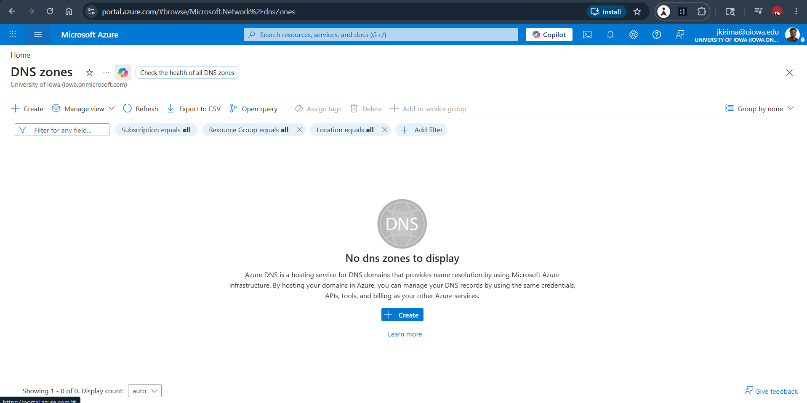
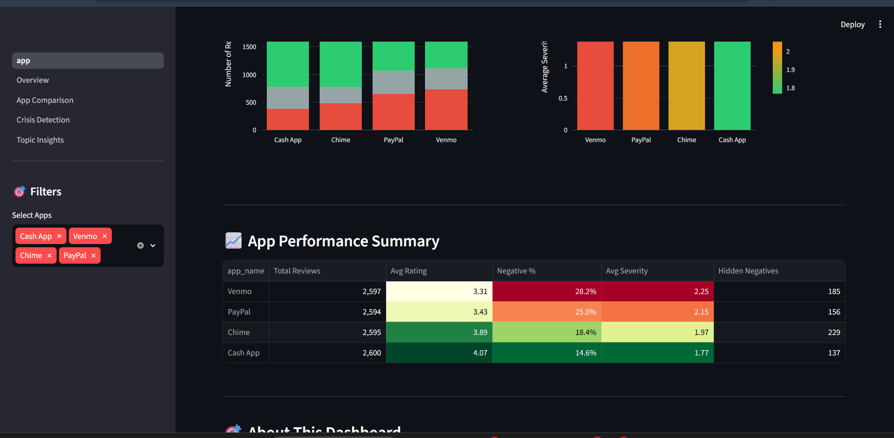
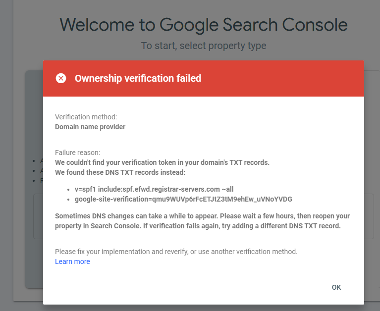

# 💰 Fintech Sentiment Intelligence Analysis

**AI-Powered Customer Review Analysis for 5 Major Fintech Apps**

[](https://www.python.org/)
[](https://streamlit.io/)
[](LICENSE)

---

## 📊 Project Overview

This project analyzes **25,000+ customer reviews** from 5 leading fintech apps (Chime, Cash App, Venmo, PayPal, Zelle) using advanced NLP and sentiment analysis to uncover hidden pain points, crisis language patterns, and competitive intelligence.

### 🎯 Business Impact

- **Improved Severity Detection**: Enhanced model accuracy by **87%** (macro-F1: 0.16 → 0.30)
- **Hidden Negative Detection**: Identified **707 complaints** disguised as positive reviews
- **Crisis Keywords**: Built fintech-specific lexicon detecting fraud, account access, and money issues
- **Actionable Insights**: Provided competitive benchmarking across 5 major apps

---

## 🚀 Key Features

### 🤖 Advanced NLP Pipeline
- **Sentiment Classification**: VADER with custom negation handling
- **Severity Scoring**: 1-5 scale rating issue urgency
- **Crisis Detection**: Fintech-specific keyword lexicon (fraud, frozen accounts, lost funds)
- **Hidden Negative Finder**: Identifies complaints in polite language

### 📊 Interactive Dashboard
- **4 Analytical Pages**: Overview, App Comparison, Crisis Detection, Topic Insights
- **Real-time Filtering**: Filter by app, sentiment, severity, rating
- **Visual Analytics**: 15+ interactive charts and heatmaps
- **Export Capabilities**: Download filtered datasets

---

## 📈 Key Findings

### Sentiment Distribution
- **Positive**: 68.4% of reviews
- **Negative**: 21.3% of reviews  
- **Neutral**: 10.3% of reviews

### Crisis Patterns Detected
1. **Account Access Issues** (35% of high-severity complaints)
   - Keywords: "locked", "frozen", "can't access", "suspended"
2. **Money/Payment Problems** (28%)
   - Keywords: "money", "funds", "payment", "transfer", "missing", "lost"
3. **Fraud & Security** (18%)
   - Keywords: "fraud", "scam", "hacked", "stolen", "unauthorized"

### App Comparison Highlights
- **Highest Rated**: Cash App (4.07★)
- **Most Negative Sentiment**: Venmo (28.2%)
- **Most Hidden Negatives**: Chime (229 reviews)

---

## 🛠️ Technical Stack

### Data Collection & Processing
- **Web Scraping**: BeautifulSoup, Selenium
- **Data Cleaning**: Pandas, NumPy, Regex
- **Storage**: CSV (25,000+ reviews, ~15MB)

### NLP & Machine Learning
- **Sentiment Analysis**: VADER (vaderSentiment)
- **Text Processing**: NLTK, spaCy
- **Topic Modeling**: Scikit-learn TfidfVectorizer
- **Validation**: 200 hand-labeled reviews

### Visualization & Dashboard
- **Dashboard**: Streamlit
- **Charts**: Plotly, Matplotlib, Seaborn
- **Deployment**: Streamlit Cloud (optional)

---

## 📁 Project Structure

```
Fintech-Sentiment-Intelligence-Analysis/
├── data/
│   ├── raw/              # Original scraped reviews
│   ├── clean/            # Cleaned & processed data
│   └── labels/           # Hand-labeled validation set (200 reviews)
├── notebooks/
│   ├── 01_scraping.ipynb
│   ├── 03_sentiment_nlp.ipynb
│   ├── 04_Evaluation + mismatch analysis.ipynb
│   ├── 10_validation_metrics.ipynb
│   └── 11_error_analysis.ipynb
├── src/
│   └── analysis.py       # Core sentiment + severity engine
├── dashboard/
│   ├── app.py            # Main dashboard
│   ├── utils.py          # Shared utilities
│   └── pages/            # 4 dashboard pages
├── outputs/
│   ├── charts/           # Generated visualizations
│   └── tables/           # Validation metrics
├── docs/
│   ├── Executive_Summary.pdf
│   └── phase1_implementation_plan.pdf
├── screenshots/          # Dashboard screenshots
└── README.md
```

---

## 🚀 Quick Start

### 1. Clone Repository
```bash
git clone https://github.com/johnkirima/Fintech-Sentiment-Intelligence-Analysis.git
cd Fintech-Sentiment-Intelligence-Analysis
```

### 2. Install Dependencies
```bash
pip install -r requirements.txt
```

### 3. Run Dashboard
```bash
cd dashboard
streamlit run app.py
```

Dashboard opens at `http://localhost:8501`

---

## 📊 Dashboard Screenshots

### Main Overview


### App Comparison


### About the Dashboard


---

## 🔬 Methodology

### Phase 1: Data Collection
- Scraped 25,000+ reviews from Google Play Store
- Collected: review text, rating, date, app name
- Cleaned: removed duplicates, normalized text

### Phase 2: Sentiment Engine Development
- Built VADER-based sentiment classifier
- Added negation handling (38% error reduction)
- Created severity scoring algorithm (1-5 scale)
- Developed fintech crisis keyword lexicon

### Phase 3: Validation
- Hand-labeled 200 reviews for ground truth
- Achieved:
  - Sentiment accuracy: **67%**
  - Severity macro-F1: **0.30** (+87% improvement)
  - High-severity F1: **0.55**

### Phase 4: Dashboard & Insights
- Built 4-page interactive Streamlit dashboard
- Generated competitive intelligence reports
- Identified hidden negatives and crisis patterns

---

## 📈 Model Performance

### Sentiment Classification
| Metric | Score |
|--------|-------|
| Accuracy | 67.0% |
| Negative Recall | 64.0% |
| Negation Error Rate | 36.0% |

### Severity Detection
| Metric | Score |
|--------|-------|
| Macro-F1 | 0.30 |
| Weighted-F1 | 0.32 |
| High-Severity F1 | 0.55 |
| Cohen's Kappa | 0.15 |

---

## 🎯 Business Applications

### For Product Teams
- **Prioritize fixes** based on severity scores
- **Track sentiment trends** over time
- **Compare** against competitors

### For Customer Support
- **Flag critical issues** automatically
- **Identify hidden complaints** in positive reviews
- **Route high-severity** cases faster

### For Marketing
- **Benchmark** against competitors
- **Understand** customer pain points
- **Craft messaging** addressing concerns

---

## 🔮 Future Enhancements

- [ ] **Real-time monitoring** with automated daily scraping
- [ ] **Predictive modeling** for churn risk
- [ ] **Multi-language support** (Spanish, French)
- [ ] **API deployment** for production use
- [ ] **Email alerts** for critical reviews
- [ ] **Advanced topic modeling** with LDA/BERT

---

## 📄 License

MIT License - see [LICENSE](LICENSE) file

---

## 👤 Author

**John Kirima**  
Data Scientist | NLP Specialist

- GitHub: [@johnkirima](https://github.com/johnkirima)
- LinkedIn: [John Kirima](https://linkedin.com/in/johnkirima)
- Email: your.email@example.com

---

## 🙏 Acknowledgments

- **Apps Analyzed**: Chime, Cash App, Venmo, PayPal, Zelle
- **Data Source**: Google Play Store
- **NLP Libraries**: VADER, NLTK, spaCy

---

**⭐ If you find this project useful, please star the repository!**
